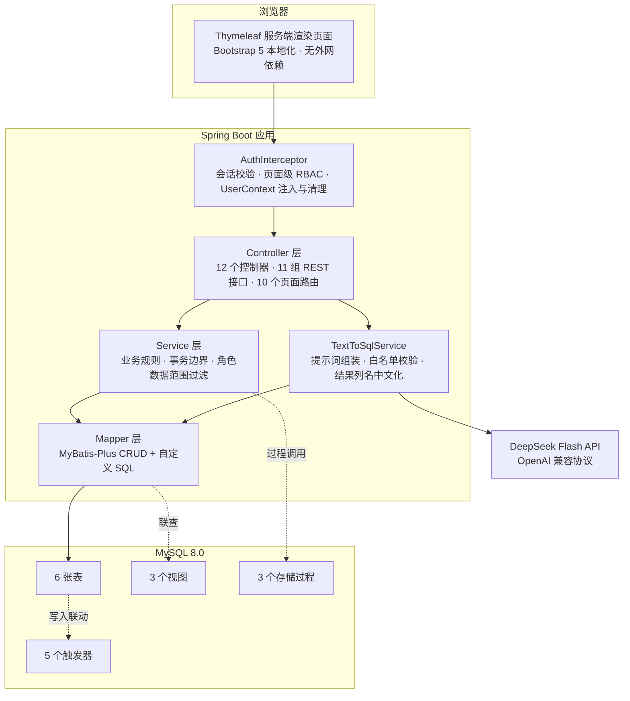

# 人事管理系统数据库课程设计 · HRMS-404

> **404 Not Found 小组** · 数据库课程设计项目
> 项目代号：**HRMS-404**（Human Resource Management System × 404 Not Found）

一个基于 **Java 17 + Spring Boot 3.5 + MySQL 8.0** 的人事管理系统。系统覆盖部门、员工、职位、考勤、薪资等核心人事业务，并把**数据库理论**（范式设计、视图、存储过程、触发器、递归 CTE）与 **大模型应用**（DeepSeek Flash 自然语言转 SQL）落到同一套真实业务里——数据库不只是被 ORM 读写的存储桶，而是承担了完整性校验、状态联动与批量计算的实际职责。

**当前状态：功能全量完成，本地运行通过**（数据库层 → 后端 API → 前端页面 → Text to SQL → RBAC 权限）。

---

## 系统架构



分层的实际约束：**权限判定集中在拦截器**（页面级粗粒度）与 **Service**（数据级细粒度，如经理只能看部门子树），Controller 不散落 `if (role == ...)`；**完整性判定下沉到数据库**（唯一索引、外键、触发器 `SIGNAL`），应用层只负责把数据库的错误转成可读提示。

### Text to SQL 执行链路


提示词里的表结构不是写死的字符串，而是**每次请求实时读 `information_schema` 拼出来**——表结构改了，模型看到的定义自动跟着改，不存在文档与数据库脱节。

---

## 快速开始

### 1. 初始化数据库

```bash
# 依次执行（MySQL 8.0；用户名密码可用环境变量 DB_USERNAME / DB_PASSWORD 覆盖）
mysql -uroot -p123456 --default-character-set=utf8mb4 < sql/01_schema.sql
mysql -uroot -p123456 --default-character-set=utf8mb4 < sql/02_views.sql
mysql -uroot -p123456 --default-character-set=utf8mb4 < sql/03_procs_triggers.sql
mysql -uroot -p123456 --default-character-set=utf8mb4 < sql/04_seed.sql
```

脚本有严格顺序：`01` 建的表与外键是 `02/03` 的前提；而 `04` 写入员工数据时会**反过来触发 `03` 里已经建好的触发器**——1000+ 个登录账号由此自动生成，`04` 里不需要手写一行 `INSERT INTO sys_user`。这正是「规则放在数据库」的直接好处：连种子数据都免于维护账号。

### 2. 启动后端

```bash
cd backend
mvn clean package -DskipTests
java -jar target/hrms-404-4.0.4.jar     # 打开 http://localhost:8080/login
```

编译目标 Java 17（`<java.version>17</java.version>`），本机以 JDK 25.0.2 运行验证。

| 环境变量 | 默认值 | 说明 |
|---|---|---|
| `DB_USERNAME` / `DB_PASSWORD` | `root` / `123456` | 数据库连接 |
| `DEEPSEEK_API_KEY` | 空 | Text to SQL 功能所需；**不配置也没有硬编码兜底**，功能降级为明确的错误提示 |
| `DEEPSEEK_BASE_URL` / `DEEPSEEK_MODEL` | `https://api.deepseek.com` / `deepseek-flash` | 接口地址与模型名，一般无需修改 |

### 3. 演示账号（密码均为 `123456`）

| 账号 | 角色 | 数据可见范围 |
|------|------|----------|
| `admin` | 系统管理员 | 全部功能、全部数据 |
| `hr01` | HR 专员 | 全部模块管理 |
| `manager01` | 销售一部 · 销售经理 | 仅销售一部及其**部门子树**内数据 |
| `E0001` ~ `E1002` | 普通员工 | 我的中心 / 打卡 / 我的薪资 |

新增员工由触发器自动按工号建号（如 `E1003`），员工离职时自动禁用账号、复职自动启用。

---

## 技术选型

| 类别 | 选型 | 说明 |
|------|------|------|
| 语言 / 构建 | Java 17 + Maven | 编译目标 17，运行于 JDK 25 |
| 后端框架 | Spring Boot 3.5.16 · Spring MVC | IoC、RESTful 接口、声明式事务 |
| 持久层 | MyBatis-Plus 3.5.17 + JdbcTemplate | 常规 CRUD 走 ORM（Mapper 全部注解式 SQL，无 XML）；Text to SQL 的动态语句与存储过程调用走原生通道 |
| 前端 | Thymeleaf + Bootstrap 5（本地化） | 服务端渲染；Bootstrap/JS 全部落盘到 `static/`，无 CDN 依赖 |
| 数据库 | MySQL 8.0 | 视图、存储过程、递归 CTE、触发器 |
| 报表导出 | Apache POI 5.5.1 | 导出为真正的 `.xlsx`（非 CSV 改名） |
| 大模型 | DeepSeek Flash API | 自然语言转 SQL，OpenAI 兼容 `/chat/completions` |

---

## 功能模块

| 模块 | 实现要点 |
|------|----------|
| 员工管理 | 多条件组合查询 + 分页、自动生成工号、逻辑删除与复职、手机号唯一约束 |
| 部门管理 | 组织树（`sp_get_org_tree` 递归 CTE 返回层级与全路径）、直属 / 含子树人数、删除前占用校验 |
| 职位管理 | 编制占用进度、**编制预算触发器**校验（超编由数据库 `SIGNAL` 拒绝，前端提示 409） |
| 考勤打卡 | 应用层先查重给出 409 提示、唯一索引 `uk_att_emp_date` 兜住并发；9:00 / 18:00 自动判定迟到早退；月度汇总走视图 |
| 薪资管理 | `sp_generate_monthly_salary` 按月幂等批量生成；实发工资由触发器计算；绩效 / 扣款可手工调整 |
| 用户权限 | 会话登录 + MD5 加盐（盐 `404n0tf0und`）、RBAC 页面 + 接口双层校验、经理数据范围 = 部门子树 |
| 数据导出 | 通用导出接口，员工 / 考勤 / 薪资 / Text to SQL 结果四处调用；Apache POI 生成真正的 `.xlsx` 并流式下载 |
| **Text to SQL** | 真实表结构注入提示词 → DeepSeek 生成 → 白名单安全校验 → 执行渲染 + 结果导出 |
| 仪表盘 | 按角色差异化统计：全公司 / 部门子树 / 个人三套口径 |

### REST 接口一览

| 分组 | 端点 |
|------|------|
| `/api/auth` | `POST /login` · `POST /logout` · `GET /me` · `POST /password` |
| `/api/employees` | `GET` · `GET /{id}` · `POST` · `PUT /{id}` · `PUT /{id}/status` · `GET /position-options` · `GET /export-list` |
| `/api/departments` | `GET /tree` · `GET /{id}` · `GET /{id}/count` · `POST` · `PUT /{id}` · `DELETE /{id}` |
| `/api/positions` | `GET` · `POST` · `PUT /{id}` · `DELETE /{id}` |
| `/api/attendance` | `POST /clock-in` · `POST /clock-out` · `GET /today` · `GET /my` · `GET /summary` |
| `/api/salaries` | `GET` · `GET /months` · `GET /my` · `POST /generate` · `PUT /{id}` |
| `/api/users` | `GET` · `GET /candidates` · `POST` · `PUT /{id}/role` · `PUT /{id}/password` · `PUT /{id}/enabled` |
| `/api/dashboard` | `GET` |
| `/api/my` | `GET /info` · `GET /salaries` · `GET /attendance` · `GET /attendance/today` |
| `/api/export` | `POST /xlsx` —— 返回 `.xlsx` 文件流 |
| `/api/text2sql` | `POST`（自然语言提问） · `POST /run-sql`（用户修正 SQL 后重跑） |

页面路由（`PageController`）：`/login` `/` `/employees` `/departments` `/positions` `/attendance` `/salaries` `/text2sql` `/my` `/users`。

---

## 数据库设计

### 表结构（6 张）

| 表 | 职责 | 关键约束 |
|---|---|---|
| `department` | 部门，自关联组织树 | 自引用外键 `parent_id → dept_id`；`headcount_budget` 可空 = 不限额 |
| `position` | 职位，隶属部门 | 外键指向 `department`；`headcount` 编制数、`base_salary DECIMAL(10,2)` |
| `employee` | 员工主数据 | `uk_emp_no` 工号唯一、`uk_emp_phone` 手机号唯一；`status` 逻辑删除位 |
| `attendance` | 每日考勤流水 | **`uk_att_emp_date (emp_id, work_date)`**；`status` 0 未完成 / 1 正常 / 2 迟到 / 3 早退 / 4 迟到且早退 |
| `salary` | 月度薪资 | `uk_salary_emp_month (emp_id, salary_month)`；`actual_salary` 由 `BEFORE INSERT` 触发器计算 |
| `sys_user` | 登录账号 | 通过 `emp_id` 与员工一对一；`role_code` 决定 RBAC 角色 |

**规范化等级**：部门名、职位名、职位基本工资等会造成传递依赖的字段一律拆表，前端展示需要的冗余联查由视图承担，而不是在表里留冗余列。候选键按「主键 + 全部 UNIQUE 约束」计：`employee` 的 `emp_no` 与 `phone`、`sys_user` 的 `username` 与 `emp_id`、`attendance` 的 `(emp_id, work_date)`、`salary` 的 `(emp_id, salary_month)` 都是候选键。

- `department` / `position` / `attendance` / `salary` / `sys_user`：所有非平凡函数依赖的决定因素都是候选键，**满足 BCNF**。
- `employee`：唯一的判断题。它同时存 `dept_id` 与 `position_id`，若把「职位决定其归属部门」当作函数依赖，`emp_id → position_id → dept_id` 就是一条对非主属性的传递依赖，等级会掉到 2NF。本项目按业务语义把两者视为**相互独立的事实**——「员工所属部门」与「所任职位归属部门」是两回事，跨部门任职、借调都是合法情形，因此不构成传递依赖，**仍满足 BCNF**。

这个判断是有依据而非事后找补：数据库层既没有约束、应用层 `validate()` 也只校验两个字段非空、不校验二者一致，UI 的下拉联动（`positionsOfDept`）只是录入便利，不是完整性规则。当前种子数据里恰好 0 条不一致记录，但那是数据现状，不是 schema 的约束。

### 视图（3 个）

| 视图 | 作用 |
|---|---|
| `v_employee_full_info` | 员工 + 部门名 + 职位名，列表页免三表 JOIN |
| `v_attendance_summary` | 按员工 × 月份聚合出勤天数与迟到早退次数 |
| `v_salary_history` | 薪资 + 员工姓名 + 部门，薪资列表与个人薪资共用 |

把联查固化成视图，而不是在每个查询里重复 `LEFT JOIN`：字段口径只有一处定义，改一次全站生效。

### 存储过程（3 个）

| 过程 | 关键实现 |
|---|---|
| `sp_count_employee_by_dept(p_dept_id)` | 递归统计该部门**及其所有子部门**的在职人数 |
| `sp_get_org_tree()` | `WITH RECURSIVE` 递归 CTE，输出 `dept_level` 层级号与 `dept_path` 全路径，供前端直接渲染树 |
| `sp_generate_monthly_salary(p_month)` | 按考勤与职位月薪批量生成当月薪资，**幂等** |

`sp_generate_monthly_salary` 里有两处值得说明的取舍：

- **幂等靠 `NOT EXISTS` 子查询**，而不是先 `DELETE` 再 `INSERT`。已手工调整过的薪资记录不会被重跑覆盖，重复点击"生成"也不会产生重复行。
- **统计值一律 `IFNULL` 兜底为 0**。当月无任何考勤记录的员工，`LEFT JOIN` 后 `late_cnt` 为 `NULL`，而 `deduction` 列是 `NOT NULL`——显式插入 `NULL` 不会回落到 `DEFAULT 0`，而是直接抛 `Column 'deduction' cannot be null` 让**整批 INSERT 失败**。三值逻辑在这里不能靠 `CASE` 兜，必须显式 `IFNULL`。

### 触发器（4 类 / 5 个对象）

| 触发器 | 时机 | 职责 |
|---|---|---|
| `trg_after_emp_insert` | `AFTER INSERT ON employee` | 按工号自动创建登录账号，密码 `MD5(CONCAT('404n0tf0und','123456'))` |
| `trg_after_emp_leave` | `AFTER UPDATE ON employee` | 离职自动禁用账号 / 复职自动启用 |
| `trg_before_salary_insert` | `BEFORE INSERT ON salary` | 实发工资 = 基本 + 绩效 − 扣款 |
| `trg_check_budget_insert` | `BEFORE INSERT ON position` | 职位编制数之和不得超过部门编制预算，超出则 `SIGNAL SQLSTATE '45000'` |
| `trg_check_budget_update` | `BEFORE UPDATE ON position` | 同上，校验时排除自身 |

### 为什么这些规则放在数据库而不是应用层

这是本项目的核心设计判断，而非"为了用触发器而用触发器"：

1. **账号联动放数据库**：入职建号、离职禁用的写入方不止一个——员工新增接口、批量导入、乃至直接执行 SQL 的运维操作。放在 Service 里只能覆盖第一条路径，放在触发器里则**任何写入方都绕不过去**。
2. **编制预算校验放数据库**：应用层"先查再写"在并发下存在竞态——两个请求同时通过检查、再同时写入，超编就成了既成事实。触发器的检查与写入在同一事务内由引擎串行化，`SIGNAL` 回滚是原子的。
3. **每日一卡：提示靠应用层，保证靠唯一索引**。`uk_att_emp_date` 是「同一天不能打两次卡」的**保证**——两个请求同时到达时，先查重再插入的写法都会放行，只有索引能挡住其中一个。但索引给不出好提示，所以应用层同时保留了 `if (已存在) 拒绝`，负责把话说清楚（「今日已打过上班卡」）；真被索引挡下时，异常处理器再把重复键翻译成 409。**前者管体验，后者管正确，两者不互相替代。**
4. **实发工资放触发器**：`actual_salary` 是由 `base + performance - deduction` 推出的派生列，不该由调用方各自计算。批量生成（存储过程）这条路径因此自动正确。

   这一条也是**四条里唯一没做彻底的**，如实记一笔：触发器只写了 `BEFORE INSERT`，没有 `BEFORE UPDATE`，所以页面调整绩效/扣款时（`SalaryService.adjust`）不得不在 Java 里把同一套算式再写一遍。同一规则落在两处，属于真实的重复——MySQL 允许为同一张表建 `BEFORE UPDATE` 触发器，补上即可把这个洞填掉，当前没做是因为调整路径只有一个入口、风险可控。

反过来，**权限与数据范围判定留在应用层**——它们依赖会话状态和角色语义，且需要给出可读的提示文案，放进数据库既表达不了也不便调试。

### 数据规模（种子数据）

1003 个账号 · 1002 名员工（981 在职）· 25 个部门 · 52 个职位 · 24528 条考勤 · 1962 条薪资记录。

---

## 工程取舍与实测数据

### Text to SQL 的推理强度选择

DeepSeek 的 `thinking` 与 `reasoning_effort` 组合，同批问题实测三档对照：

| 配置 | 耗时 | 部门树问题的实际表现 |
|---|---|---|
| `thinking.type=disabled` | 0.7 ~ 0.8s | 生成 `UNION` 硬编码两层的写法。本库部门树恰好 3 层，结论仍然正确；**一旦层级加深就会漏掉更深的分支**，而它依旧是合法 `SELECT`，后置安全校验拦不住——属于"能跑但结果可能不准" |
| `reasoning_effort=low` | 简单查询约 1s，多层递归问题可达 5s | 稳定生成 `WITH RECURSIVE`，对层级深度不敏感 |
| 默认强度 | 6 ~ 7s | 同样正确，但明显更慢 |

**取 `low`**：用一点响应时间换取对多层部门树的结构健壮性，同时比默认强度快数倍。这个取舍之所以成立，是因为「结果正确」优先于「响应快」——性能要求的前提是答案先得对。`low` 档的耗时随问题复杂度浮动较大（见下方实测），但即使是 5s 的那一档，服务端 SQL 也只占 2 毫秒，浮动全部来自模型推理。

### 安全校验为什么是必需的

模型输出不可信，校验必须发生在**语句进入数据库之前**，且 `runUserSql`（用户手工修正后重跑）与 AI 生成走**同一条校验通道**，不存在绕过路径：

- 仅允许 `SELECT` / `WITH` 开头
- 19 个危险关键词黑名单（`drop` `delete` `update` `insert` `alter` `truncate` `create` `grant` `revoke` `into outfile` `load_file` `sleep(` `benchmark(` 等），带单词边界防误伤列名
- 禁止访问 `information_schema` / `performance_schema` / `mysql.` / `sys.`
- 禁止多语句（拦截 `;` 注入）
- 未带 `LIMIT` 时强制补 `LIMIT 100`

### 实测性能

| 场景 | 规模 | 实测 |
|---|---|---|
| 导出员工 Excel | 1002 行 × 9 列 | 55,880 B `.xlsx`；预热后 0.19 ~ 0.33s，首次含 POI 冷启动约 0.97s |
| AI 自然语言查询 | 单次往返 | 0.8 ~ 5.2s，**几乎全部是模型推理**——服务端 SQL 执行仅 2 ~ 3 ms（响应里的 `costMs`） |
| 登录页首屏 | — | 266,751 B = HTML 10,404 + `hrms.css` 22,899 + `bootstrap.min.css` 232,803 + favicon 645 |

导出那一行的两组数字值得对比着看：`fetch` 拿数据的接口（`export-list`，1002 行）只要 **0.03s**，而生成 `.xlsx` 本身是 **0.2s 级**——瓶颈在 POI 组装与序列化，不在数据库。AI 查询同理，5 秒里数据库只占 2 毫秒。**把延迟拆开看，才知道该优化哪里、哪里根本不用动。**

### 导出为什么最终回到 fetch 而不是原生表单

这个功能来回改过两次，两次都在解决真问题，最终方案是权衡后的结果：

1. **最初的 `fetch` + `Blob` + `URL.createObjectURL`** 在部分浏览器上文件名丢失，被存成无后缀的随机 UUID。
2. **于是改成原生表单 POST**：把响应交给浏览器去导航，`Content-Disposition` 由浏览器原生处理，确实彻底绕开了 Blob 文件名问题。
3. **但表单提交的代价随即暴露**：响应一旦不是文件，浏览器就会拿它替换当前页面——会话过期返回 401 JSON、参数异常返回 400 JSON、服务端异常返回错误页，用户看到的是「点一下导出，整个页面没了」。
4. **现在回到 `fetch`**，靠下面几条把当初的文件名问题单独解决掉，两个问题就不再互相绑架：
   - 文件名优先解析 `Content-Disposition` 里 RFC 5987 的 `filename*`（中文文件名走这条），退回 ASCII 的 `filename`
   - `revokeObjectURL` **延迟 10 秒**执行——点击后浏览器是异步读 blob 的，同步 revoke 会掐断数据流，轻则文件损坏，重则文件名回退成 blob URL 的随机 UUID
   - 下载链接必须先 `appendChild` 入文档再 `click()`，游离节点上的 `click()` 在部分浏览器不触发下载
   - 响应只有 `spreadsheetml` MIME 才当文件处理，其余一律走错误分支：401 提示跳登录，其他把服务端 `message` 转成 toast，页面毫发无损

---

## 小组特征元素（404 Not Found）

组名取自 HTTP 状态码 404，系统全流程植入品牌细节：

- 自定义 **404 错误页**：大号 404 + "页面不存在，已被按离职流程处理"
- 页签标题统一 `xx · HRMS-404`、顶栏 404 徽标、页脚小组署名
- 空数据占位统一 "404：暂无数据"、Toast 删除提示"已从列表 404"
- 浏览器控制台彩蛋、密码盐 `404n0tf0und`
- 版本号 v4.0.4

完整清单见 [`开发文档.md` 第 4.4 节](开发文档.md)。

---

## 目录结构

```
.
├── README.md          # 本文件
├── 开发文档.md         # 设计文档（架构 / 数据库 / AI 接入 / 404 元素）
├── sql/               # 建库脚本，须按序号执行
│   ├── 01_schema.sql          # 6 张表 · 外键 · 唯一索引
│   ├── 02_views.sql           # 3 个视图
│   ├── 03_procs_triggers.sql  # 3 个存储过程 · 5 个触发器
│   └── 04_seed.sql            # 种子数据（写入时触发 03 的触发器）
└── backend/           # Spring Boot 后端（含 Thymeleaf 前端页面）
    ├── pom.xml
    └── src/main/
        ├── java/com/hrms404/            # 62 个类，按职责分包
        │   ├── controller/  (12)  # 页面路由 + REST 接口
        │   ├── service/      (9)  # 业务规则、事务边界、数据范围过滤
        │   ├── mapper/       (11) # MyBatis-Plus Mapper（注解式 SQL，无 XML）
        │   ├── entity/        (6) # 六张表各一个实体
        │   ├── vo/            (9) # 视图对象：组织树节点、汇总行、登录态等
        │   ├── common/       (10) # Result / PageResult / BizException 等通用件
        │   ├── config/        (3) # WebConfig · MybatisPlusConfig · DeepSeekProps
        │   └── security/      (2) # AuthInterceptor · PasswordUtil
        └── resources/
            ├── application.yml
            ├── static/      # css/ · js/ · vendor/（Bootstrap 本地化）· favicon.svg
            └── templates/   # 10 个页面模板 + fragments.html 公共片段
                └── error/   # 403 · 404 · 500 品牌错误页
```

`common` 放的是跨层复用的基础件，不参与分层：统一响应体 `Result`、分页载体 `PageResult`、业务异常 `BizException`、全局异常处理器 `GlobalExceptionHandler`、登录态 `LoginSession`、**`UserContext`（ThreadLocal，由拦截器写入、请求结束清理）**、角色常量 `Roles`、经理数据范围计算 `ScopeUtil`。`UserContext` 放在 `common` 而非 `security`，是因为它被 Service 层直接读取——放在 `security` 会让 Service 反向依赖安全包。

## 文档

- [开发文档.md](开发文档.md)：分层架构、数据库设计思路、RESTful API 规范、Text to SQL 设计、DeepSeek Flash 接入设计、404 特征元素设计

---

*© 2026 404 Not Found 小组 · 人事管理系统数据库课程设计*
